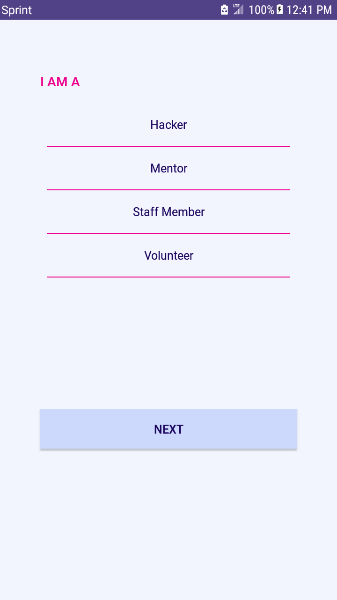
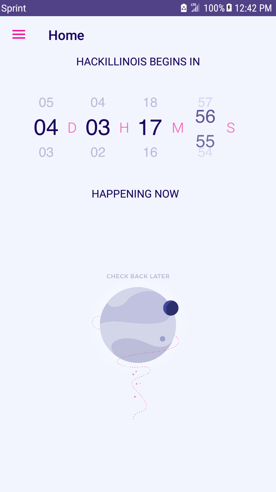
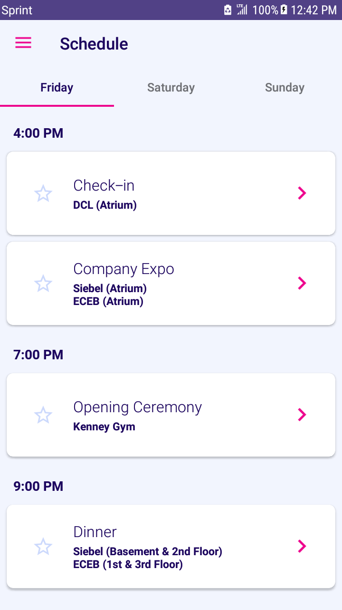
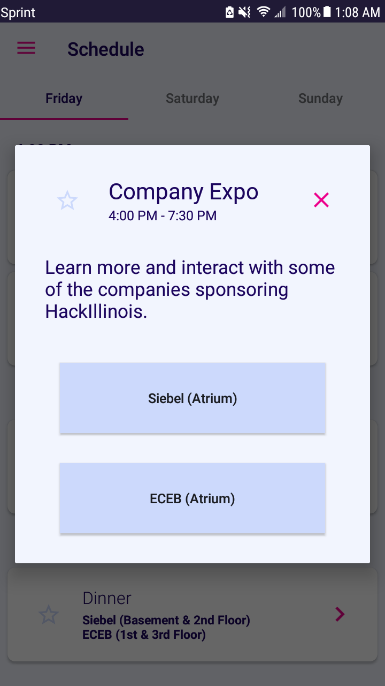

# Official [HackIllinois](https://hackillinois.org/) Android App

## Development

**master** is under active development and should be considered *mostly* stable.

**feature/_enhancement_** is where all new features and fixes are stored.

All **releases** of the app will be tagged as **vX.Y.Z**

Please [file an issue](https://github.com/HackIllinois/android-2017/issues/new) for any **bugs** or **features** you happen to find. All contributions are welcome.

## Screenshots

     